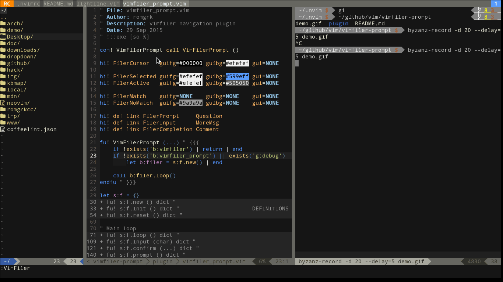

# Vimfiler prompt

Navigate VimFiler by typing + autocompletion



## Usage

Command: `VimFilerPrompt`

Map something to `VimFilerPrompt`, and that's it.

```viml
nmap <buffer> i :VimFilerPrompt<CR>
```

## Mappings

`<TAB>` : autocomplete; if there is only 1 match, jumps directly

`<S-TAB>`: previous completion

`<CR>`, `/`: jump

`..`: parent directory

## Highlight groups 

```viml
hi! FilerCursor   guifg=#000000 guibg=#efefef gui=NONE   

hi! FilerSelected guifg=#efefef guibg=#599eff gui=NONE
hi! FilerActive   guifg=#efefef guibg=#505050 gui=NONE

hi! FilerMatch    guifg=NONE    guibg=NONE    gui=NONE
hi! FilerNoMatch  guifg=#9a9a9a guibg=NONE    gui=NONE

hi! def link FilerPrompt     Question
hi! def link FilerInput      MoreMsg
hi! def link FilerCompletion Comment
```
